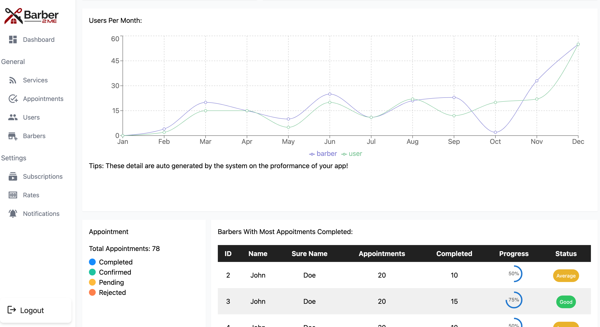
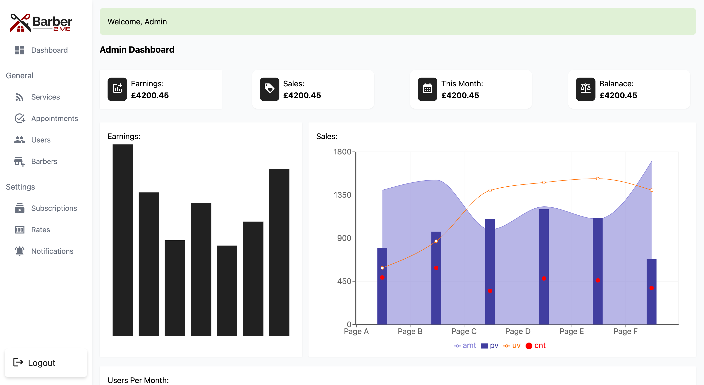
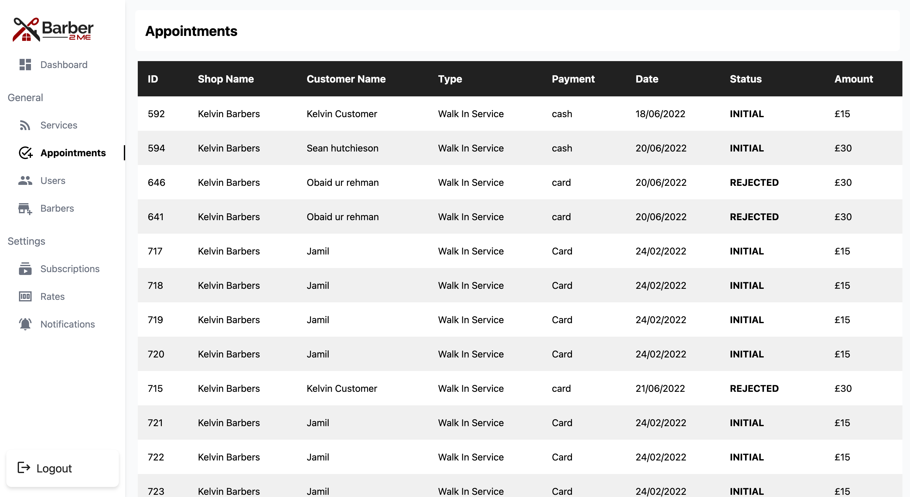
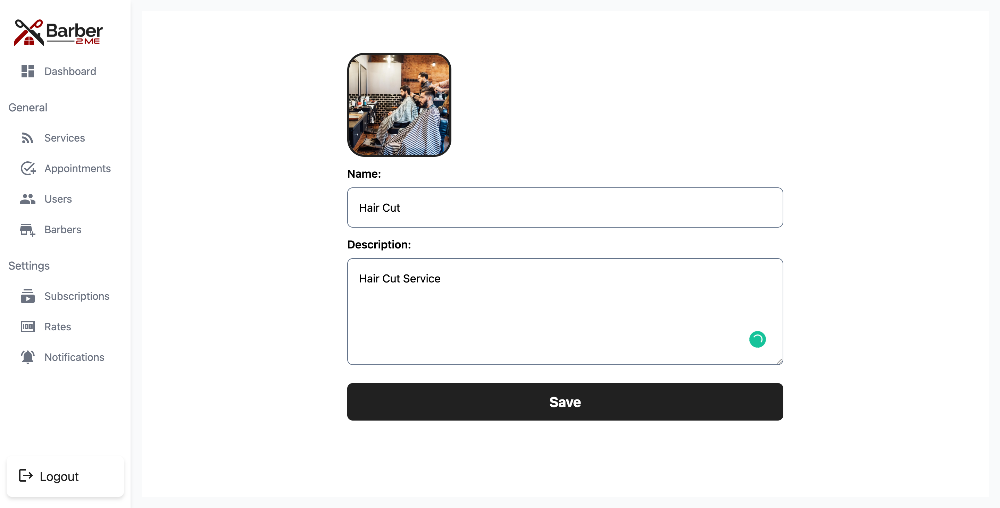
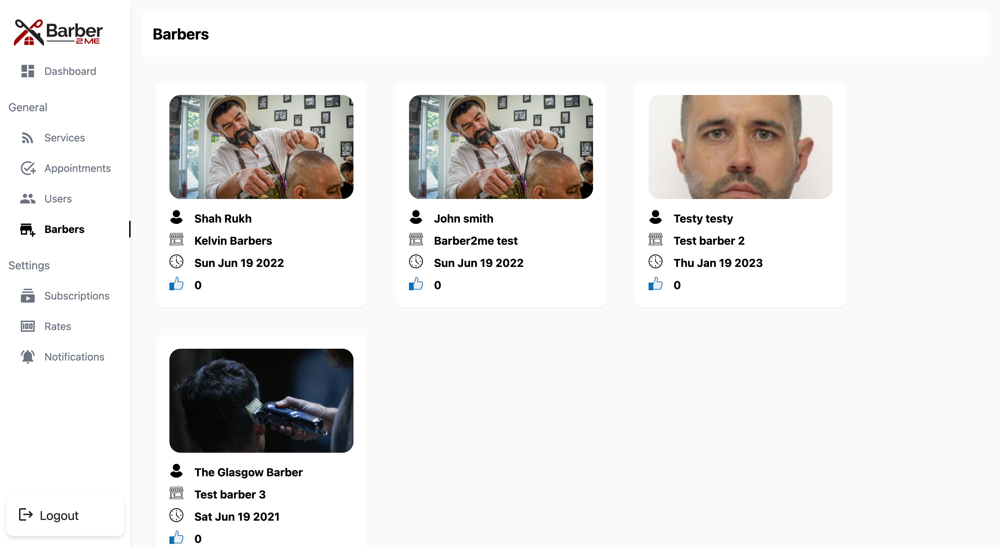
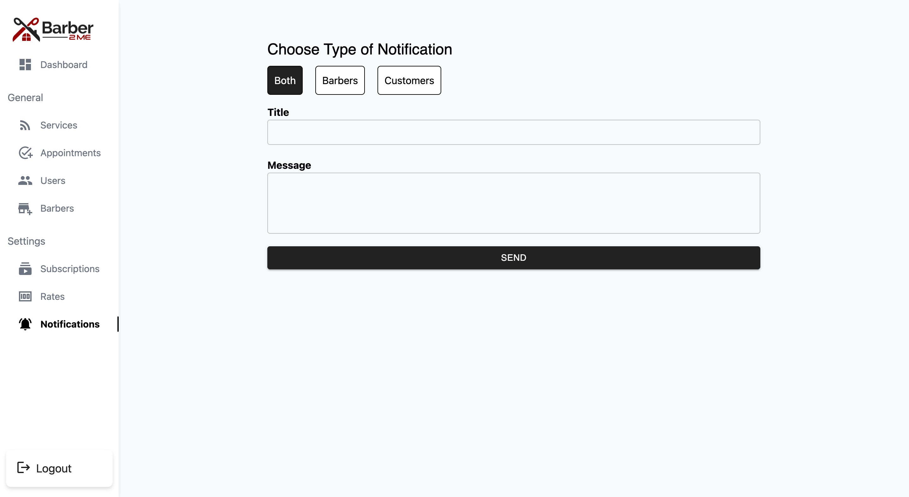

<div id="top"></div>

<!-- PROJECT LOGO -->
<br />
<div align="center">
  <a href="https://github.com/iusmansultan/barbar-to-me-dashboard">
    
  </a>

  <h3 align="center">Barber-2-Me Dashboard</h3>

  <p align="center">
   The Barber2me offers Services constitute a technology platform that enables users of Barber2me mobile applications or websites provided as part of the Services (each, an “Application”) to arrange and schedule Barbering services with independent third-party providers of such services, including independent third party Barbers. This Dashboard Helps admins to controll their services and user with all progress and mentinance.
    <br />
    <a href="https://github.com/iusmansultan"><strong>Explore the docs »</strong></a>
    <br />
    <br />
    <a href="https://barber-2-me.web.app/" target="blank" >View Demo</a>
    
  </p>
</div>

<!-- ABOUT THE PROJECT -->

## About The Project



The **Barber2me** offers Services constitute a technology platform that enables users of Barber2me mobile applications or websites provided as part of the Services (each, an “Application”) to arrange and schedule Barbering services with independent third-party providers of such services, including independent third party Barbers. This Dashboard Helps admins to controll their services and user with all progress and mentinance.

<p align="right">(<a href="#top">back to top</a>)</p>

### Built With

This Web Admin Panel was built with some technologies below:

- [React](https://reactjs.org/)
- [Redux](https://redux.js.org/)
- [Axios](https://axios-http.com/)
- [Chart](https://chart.js)
- [AWS] (https://aws.amazon.com)

<p align="right">(<a href="#top">back to top</a>)</p>

## Getting Started

### Prerequisites

- npm
  ```sh
  npm install npm@latest -g
  ```

### Installation

1. Clone the repo
   ```sh
   git clone https://github.com/iusmansultan/barbar-to-me-dashboard
   ```
2. Install NPM packages
   ```sh
   npm install
   ```
3. Start the Application
   ```sh
   npm start
   ```

## Demonstration

## Snippets

Here are some snippets about this app:

|  |
|  |
|  |
|  |
|  |
|  |

<p align="right">(<a href="#top">back to top</a>)</p>

## Barber2Me Update!

**Barber2me** is currently in development process!

<p align="right">(<a href="#top">back to top</a>)</p>

<!-- CONTACT -->

## Developer

<center>
  <table>
    <tr>
      <td align="center">
        <a href="https://github.com/iusmansultan">
          <br/>
          <sub><b>Muhammad Usman</b></sub>
        </a>
      </td>
    </tr>
  </table>
</center>

<p align="right">(<a href="#top">back to top</a>)</p>
# AFS-Schooler-Admin-Panel
